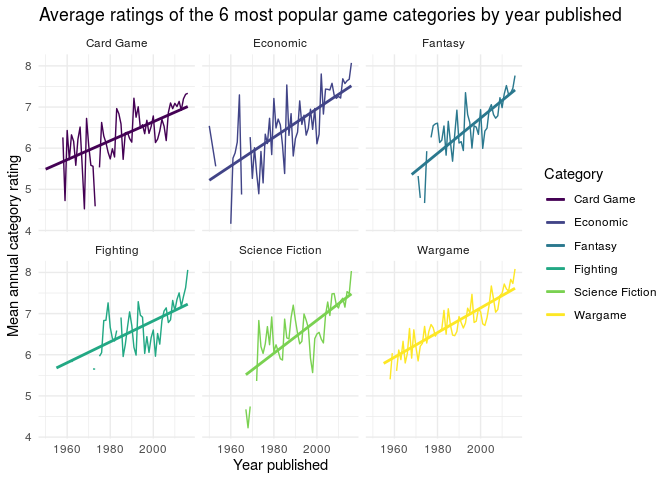
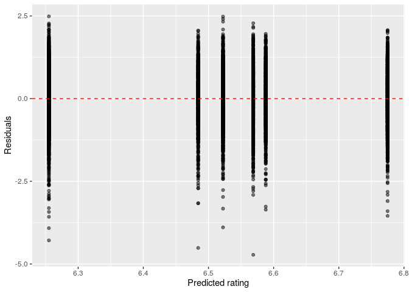

Connor’s Testing with Categories
================

basic setup :)

``` r
library(tidyverse)
library(broom)
library(pander)
library(here)
library(tidymodels)
library(fitdistrplus)
```

``` r
board_games <- read_csv(here("data/board_games.csv"))
```

Totally not stealing from the proposal

``` r
board_games_splitcats <- board_games %>% 
  mutate(categories = str_split(category, ","))

popular_categories <- board_games_splitcats %>%
  pull(categories) %>%
  unlist %>%
  as_tibble %>%
  count(value) %>%
  arrange(desc(n)) %>%
  head(6)

popular_categories %>%
  pander
```

|      value      |  n   |
| :-------------: | :--: |
|    Card Game    | 2981 |
|     Wargame     | 2034 |
|     Fantasy     | 1218 |
|    Fighting     | 900  |
|    Economic     | 878  |
| Science Fiction | 850  |

``` r
popular_categories <- pull(popular_categories, value)
```

Just looking at how many damn rows we have here

``` r
board_games_topcats <- board_games_splitcats %>% 
  filter(map_lgl(categories, ~any(popular_categories %in% .x)))
```

We can investigate the changes in quality of different categories of
games. For example, investigating how the quality of board games in the
six most common categories changes over time. As a measure of quality,
we use the mean rating given to a game in that category (that is, the
sum of all ratings in a category (in a given year) divided by the total
number of such ratings).

``` r
av_annual_rating <- function(df, cat = NULL) {
  {if(!is.null(cat)) {
    df %>% filter(map_lgl(categories, ~cat %in% .x))
  } else {
    df
  }} %>% 
  group_by(year_published) %>% 
  summarise(av_annual_rating = sum(average_rating * users_rated) / sum(users_rated))
}
# finds average rating (of a category (cat) if given) of board games in dataframe given (df) for each year in which a board game of that category was published. Output is a dataframe. df must have columns `year published`, `categories` (a `list` of categories), `average_rating` and `year_published`. 

cats <- map(popular_categories, ~av_annual_rating(df = board_games_topcats, cat = .))

cat_ratings <- reduce(cats, ~full_join(.x,.y, by = "year_published")) %>% 
  arrange(year_published)

if(any(is.na(popular_categories))) {
  popular_categories[[which(is.na(popular_categories))]] <- "not_categorised"
} 

names(cat_ratings) <- c("year_published", popular_categories)
```

``` r
cat_ratings %>% 
  pivot_longer(cols = 2:ncol(cat_ratings), names_to = "category", values_to = "av_rating") %>% 
  ggplot(aes(x = year_published, y = av_rating, colour = category)) + 
  geom_line() +
  geom_smooth(method = "lm", se = FALSE) +
  facet_wrap(~ category) +
  labs(
    x = "Year published", 
    y = "Mean annual category rating", 
    colour = "Category", 
    title = "Average ratings of the 6 most popular game categories by year published"
  ) + 
  scale_color_viridis_d() +
  theme_minimal()
```

    ## `geom_smooth()` using formula 'y ~ x'

<!-- -->

Now looking at category vs rating cause it looks like the year published
will send the rating up but maybe not the category itself

``` r
board_games_empty <- board_games_splitcats %>%
  filter(FALSE)
board_games_popcats <- board_games_empty

for (c in popular_categories) {
  board_games_popcats <- full_join(
    board_games_popcats,
    board_games_splitcats %>%
      filter(map_lgl(categories, ~c %in% .x)) %>%
      mutate(category = c)
  )
}
```

    ## Joining, by = c("game_id", "description", "image", "max_players", "max_playtime", "min_age", "min_players", "min_playtime", "name", "playing_time", "thumbnail", "year_published", "artist", "category", "compilation", "designer", "expansion", "family", "mechanic", "publisher", "average_rating", "users_rated", "categories")
    ## Joining, by = c("game_id", "description", "image", "max_players", "max_playtime", "min_age", "min_players", "min_playtime", "name", "playing_time", "thumbnail", "year_published", "artist", "category", "compilation", "designer", "expansion", "family", "mechanic", "publisher", "average_rating", "users_rated", "categories")
    ## Joining, by = c("game_id", "description", "image", "max_players", "max_playtime", "min_age", "min_players", "min_playtime", "name", "playing_time", "thumbnail", "year_published", "artist", "category", "compilation", "designer", "expansion", "family", "mechanic", "publisher", "average_rating", "users_rated", "categories")
    ## Joining, by = c("game_id", "description", "image", "max_players", "max_playtime", "min_age", "min_players", "min_playtime", "name", "playing_time", "thumbnail", "year_published", "artist", "category", "compilation", "designer", "expansion", "family", "mechanic", "publisher", "average_rating", "users_rated", "categories")
    ## Joining, by = c("game_id", "description", "image", "max_players", "max_playtime", "min_age", "min_players", "min_playtime", "name", "playing_time", "thumbnail", "year_published", "artist", "category", "compilation", "designer", "expansion", "family", "mechanic", "publisher", "average_rating", "users_rated", "categories")
    ## Joining, by = c("game_id", "description", "image", "max_players", "max_playtime", "min_age", "min_players", "min_playtime", "name", "playing_time", "thumbnail", "year_published", "artist", "category", "compilation", "designer", "expansion", "family", "mechanic", "publisher", "average_rating", "users_rated", "categories")

``` r
cat_fit <- linear_reg() %>%
  set_engine("lm") %>%
  fit(average_rating ~ category, data = board_games_popcats)

cat_fit_aug <- augment(cat_fit$fit)

ggplot(cat_fit_aug, mapping = aes(x = .fitted, y = .resid)) +
  geom_point(alpha = 0.5) +
  geom_hline(yintercept = 0, color = "red", lty = "dashed") +
  labs(x = "Predicted rating", y = "Residuals")
```

<!-- -->

``` r
glance(cat_fit)
```

    ## # A tibble: 1 x 12
    ##   r.squared adj.r.squared sigma statistic   p.value    df  logLik    AIC    BIC
    ##       <dbl>         <dbl> <dbl>     <dbl>     <dbl> <dbl>   <dbl>  <dbl>  <dbl>
    ## 1    0.0540        0.0535 0.825      101. 5.35e-104     5 -10871. 21756. 21805.
    ## # … with 3 more variables: deviance <dbl>, df.residual <int>, nobs <int>

Stealing from Arjun because I can lol
