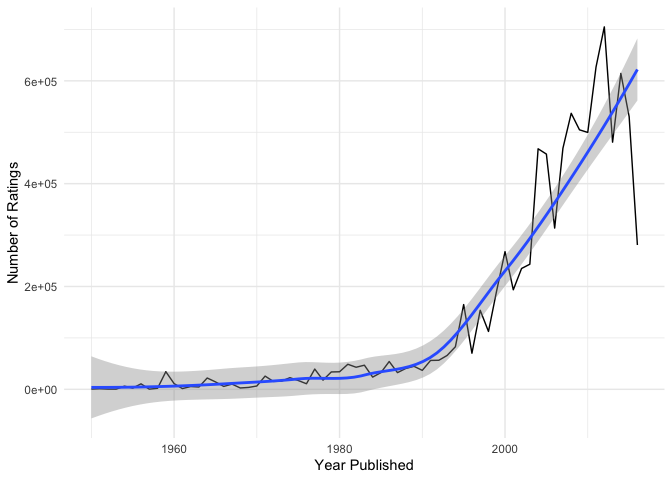

Bruce’s little playground
================

## Setup

``` r
library(tidyverse)
library(tidymodels)
library(here)
library(pander)
```

``` r
board_games <- read_csv(here("data/board_games.csv"))
```

## Year Published vs Rating

Here we see that average ratings have an overall upwards trend, with a
brief plateau from 1980 to 2000 and then a sharp rise. This seems to
suggest that the preference of the Board Game Geek community is more
toward more recent games than older ones, and possibly that board games
fall out of favour as they age, although as we have no past ratings data
there is no way to verify this.

``` r
board_games %>%
  group_by(year_published) %>%
  summarise(rating = mean(average_rating)) %>%
  ggplot(aes(
    x = year_published,
    y = rating
  )) +
  geom_line() +
  geom_smooth() +
  theme_minimal() +
  labs(
    x = "Year Published",
    y = "Rating"
  )
```

<!-- -->

Fitting a linear regression we can see that the year a game was
published does affect its ratings, but it is far from completely
explaining it.

``` r
year_published_rating_fit <- linear_reg() %>%
  set_engine("lm") %>%
  fit(average_rating ~ year_published, data = board_games)

pander(glance(year_published_rating_fit))
```

| r.squared | adj.r.squared | sigma | statistic |  p.value   | df  | logLik |
|:---------:|:-------------:|:-----:|:---------:|:----------:|:---:|:------:|
|  0.09508  |     0.095     | 0.809 |   1106    | 8.916e-231 |  1  | -12710 |

Table continues below

|  AIC  |  BIC  | deviance | df.residual | nobs  |
|:-----:|:-----:|:--------:|:-----------:|:-----:|
| 25427 | 25449 |   6891   |    10530    | 10532 |

## Year Published vs Number of Ratings

Here we can see that games older than 1980 have almost no ratings in
comparison to more recent games, where we see exponential growth in
users rated. This shows us that more recent games are much more reviewed
than those before 1980. So it is clear that not only are older games
less well rated, they are also rated by fewer people.

``` r
board_games %>%
  group_by(year_published) %>%
  summarise(users = sum(users_rated)) %>%
  ggplot(aes(
    x = year_published,
    y = users
  )) +
  geom_line() +
  geom_smooth() +
  theme_minimal() +
  labs(
    x = "Year Published",
    y = "Number of Ratings"
  )
```

<!-- -->

## Most Popular Categories Over Time

First, we find the most popular categories overall.

``` r
board_games_splitcats <- board_games %>% 
  mutate(categories = str_split(category, ","))

popular_categories <- board_games_splitcats %>%
  pull(categories) %>%
  unlist %>%
  as_tibble %>%
  count(value) %>%
  arrange(desc(n)) %>%
  head(6) %>%
  pull(value)
```

Next, we find all of the games in each of these categories. We are okay
with duplicate rows, as if a game is in two of the most popular
categories we want it to be accounted for in both categories.

``` r
board_games_empty <- board_games_splitcats %>%
  filter(FALSE)
board_games_popcats <- board_games_empty

for (c in popular_categories) {
  board_games_popcats <- full_join(
    board_games_popcats,
    board_games_splitcats %>%
      filter(map_lgl(categories, ~c %in% .x)) %>%
      mutate(category = c)
  )
}
```

Finally, we can plot the popularity of each category over time.
Popularity, here, refers to the number of board games in each category
as this is analogous to popularity among board game manufacturers.

``` r
board_games_popcats %>%
  group_by(category, year_published) %>%
  summarise(count = n()) %>%
  ggplot(aes(
    x = year_published,
    y = count,
    color = category
  )) +
  geom_line() +
  theme_minimal() +
  labs(
    x = "Year Published",
    y = "Number of Games",
    color = "Category"
  )
```

<!-- -->

We can see here that the number of games has an upward trend. For one,
after about 1990, card games start to rise far above the others in terms
of popularity. This may be because with the growing popularity of the
internet, it became much easier for people to make and share their own
card games. Also, around 1970, the number of wargames drastically
increased, becoming noticeably more popular than every other category
until being overtaken by card games around 2010 and then all the other
popular categories more recently.
