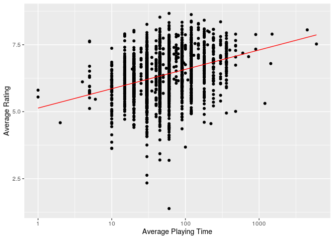
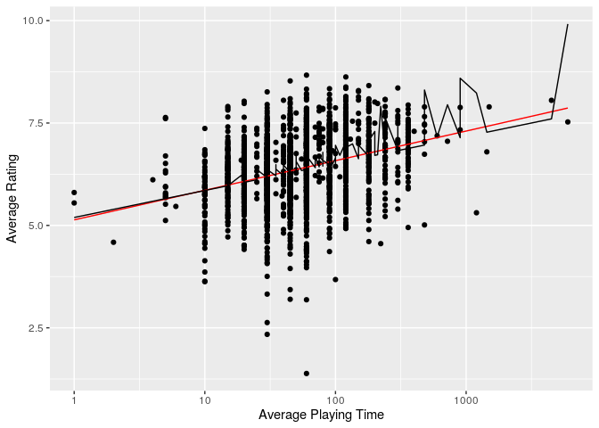

average rating \~ playtime
================

``` r
library(tidyverse)
library(broom)
library(pander)
library(here)
library(tidymodels)
```

## Initial PLots

``` r
board_games %>%
  ggplot(aes(playing_time, average_rating)) +
  geom_point(alpha = 0.6)
```

<!-- -->

We can see that this plot is fairly useless as the x axis is stretched
very far because there is a game with a playtime of 60000 minutes. To
counter this I will log the x axis.

``` r
board_games %>%
  filter(playing_time != 0) %>%
  ggplot(aes(playing_time, average_rating)) +
  geom_point(alpha = 0.6) +
  scale_x_log10() +
  labs(title = "Average Rating against Playing Time", x = "Playing Time", y = "Average Rating")
```

<!-- -->

After manipulating the axes and filtering out games with a
`playing_time` = 0, we can see that there is a slight positive
correlation between the `playing_time` and `average_rating`.

## Splitting Data

Here I just want to split my data into training data and testing data so
that I can experiment and work on my model before lettin git model all
of the data to avoid overfitting the model.

``` r
board_games <- board_games %>%
  filter(playing_time != 0, min_playtime != 0)

set.seed(1116)

games_split <- initial_split(board_games, prop = 0.8)
train_data <- training(games_split)
test_data <- testing(games_split) 

# splitting data into training/test data
```

## Creating Models

Here I am creating two simple linear regression models between
`playing_time` and `average_rating`, and `playing_time`, `min_playtime`
and `average_rating`. I puprosely left out `max_playtime` because in the
data `playing_time` and `max_playtime` are always the same, meaning that
adding the `max_playtime` would be irrelevant.

``` r
games_lm_mod <- linear_reg() %>%
  set_engine("lm")

games_play_recipe <- recipe(average_rating ~ playing_time, data = train_data) %>%
  step_log(all_predictors())

# for the same reason I logged the x axis in the second plot,
# I am logging the data to make the plot nicer

games_play_workflow <- workflow() %>%
  add_model(games_lm_mod) %>%
  add_recipe(games_play_recipe)

# here I am fitting the model to the train data

games_play_fit <- games_play_workflow %>% 
  fit(data = train_data)

# Here I am doing exactly the same process as before
# the only difference is that I am including `min_playtime` in the model now

games_play_all_recipe <- recipe(
  average_rating ~ playing_time + min_playtime,
  data = train_data
  ) %>%
  step_log(all_predictors())

games_play_all_workflow <- workflow() %>%
  add_model(games_lm_mod) %>%
  add_recipe(games_play_all_recipe)

games_play_all_fit <- games_play_all_workflow %>%
  fit(data = train_data)
```

``` r
# this code is creating a data frame of the predicted
# average ratings based on the model with only the
# `playing_time` variable

games_play_pred <- predict(games_play_fit, test_data) %>%
  bind_cols(test_data)

games_play_pred %>%
  ggplot(aes(x = playing_time)) +
  geom_point(aes(y = average_rating)) +
  geom_line(aes(y = .pred), colour = "red") +
  scale_x_log10() +
  labs(x = "Average Playing Time", y = "Average Rating")
```

<!-- -->

``` r
# this code is doing the same as above, creating a data frame
# of the predicted average values from the model with 
# `playing_time` and `min_playtime`

games_play_all_pred <- predict(games_play_all_fit, test_data) %>%
  bind_cols(test_data)

# here I am joining the data frames so I am able to see the predicted
# average rating from the simple model and the model with both
# variables in one place compared to the actual `average_rating`

predict_both <- games_play_all_pred %>%
  mutate(.pred_all = .pred, .keep = "unused") %>%
  right_join(games_play_pred) %>%
  select(.pred, .pred_all, average_rating, everything())
```

    ## Joining, by = c("game_id", "description", "image", "max_players", "max_playtime", "min_age", "min_players", "min_playtime", "name", "playing_time", "thumbnail", "year_published", "artist", "category", "compilation", "designer", "expansion", "family", "mechanic", "publisher", "average_rating", "users_rated")

``` r
predict_both %>%
    ggplot(aes(x = playing_time)) +
  geom_point(aes(y = average_rating)) +
  geom_line(aes(y = .pred), colour = "red") +
  geom_line(aes(y = .pred_all), coloiur = "green") +
  scale_x_log10() +
  labs(x = "Average Playing Time", y = "Average Rating")
```

    ## Warning: Ignoring unknown parameters: coloiur

<!-- -->

## Evaluating my models

To evaluate the models I used chi squared and root mean squared error
(RMSE).

``` r
rmse(games_play_pred, average_rating, .pred)
```

    ## # A tibble: 1 x 3
    ##   .metric .estimator .estimate
    ##   <chr>   <chr>          <dbl>
    ## 1 rmse    standard       0.790

``` r
#evaluating my average_rating ~ playing_time model using root mean square error

rmse(games_play_all_pred, average_rating, .pred)
```

    ## # A tibble: 1 x 3
    ##   .metric .estimator .estimate
    ##   <chr>   <chr>          <dbl>
    ## 1 rmse    standard       0.781

``` r
#evaluating my average_rating ~ playing_time + min_playtime model using chi squared and root mean square error
```

    ## 
    ## Attaching package: 'rlang'

    ## The following objects are masked from 'package:purrr':
    ## 
    ##     %@%, as_function, flatten, flatten_chr, flatten_dbl, flatten_int,
    ##     flatten_lgl, flatten_raw, invoke, list_along, modify, prepend,
    ##     splice

    ## 
    ## Attaching package: 'vctrs'

    ## The following object is masked from 'package:dplyr':
    ## 
    ##     data_frame

    ## The following object is masked from 'package:tibble':
    ## 
    ##     data_frame

Evaluating my model with only `playing_time` variable  

    ## # A tibble: 2 x 6
    ##   .metric .estimator  mean     n std_err .config             
    ##   <chr>   <chr>      <dbl> <int>   <dbl> <chr>               
    ## 1 rmse    standard   0.784    50 0.00800 Preprocessor1_Model1
    ## 2 rsq     standard   0.127    50 0.00722 Preprocessor1_Model1

    ## # A tibble: 1 x 12
    ##   r.squared adj.r.squared sigma statistic   p.value    df logLik    AIC    BIC
    ##       <dbl>         <dbl> <dbl>     <dbl>     <dbl> <dbl>  <dbl>  <dbl>  <dbl>
    ## 1     0.121         0.121 0.786     1119. 6.46e-230     1 -9585. 19175. 19196.
    ## # … with 3 more variables: deviance <dbl>, df.residual <int>, nobs <int>

evaluating my model with `playing_time` and `min_playtime` variables

    ## # A tibble: 2 x 6
    ##   .metric .estimator  mean     n std_err .config             
    ##   <chr>   <chr>      <dbl> <int>   <dbl> <chr>               
    ## 1 rmse    standard   0.770    50 0.00801 Preprocessor1_Model1
    ## 2 rsq     standard   0.161    50 0.00746 Preprocessor1_Model1

    ## # A tibble: 1 x 12
    ##   r.squared adj.r.squared sigma statistic   p.value    df logLik    AIC    BIC
    ##       <dbl>         <dbl> <dbl>     <dbl>     <dbl> <dbl>  <dbl>  <dbl>  <dbl>
    ## 1     0.153         0.152 0.771      733. 2.43e-293     2 -9435. 18877. 18905.
    ## # … with 3 more variables: deviance <dbl>, df.residual <int>, nobs <int>

We can see from comparing the 2 RMSE and adjusted r squared mean values
that the model that includes `min_playtime` as well as `playing_time` is
a better model, however this does not mean that either are good models.
