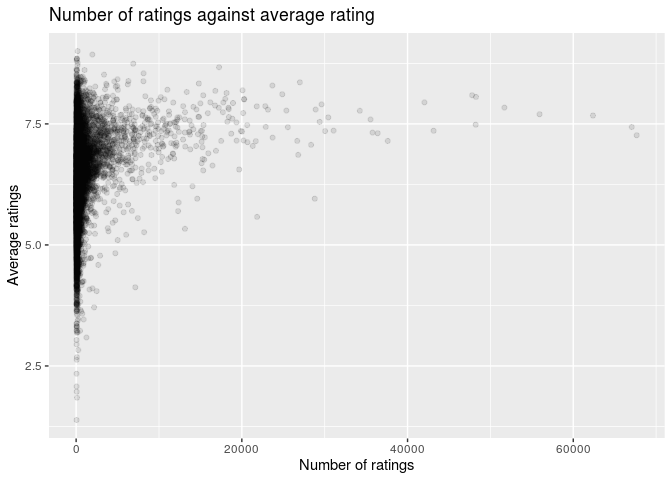
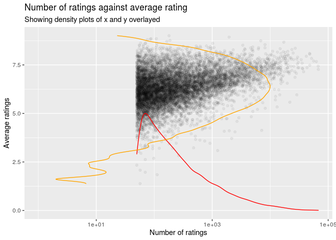
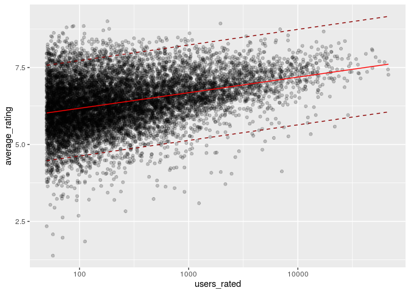
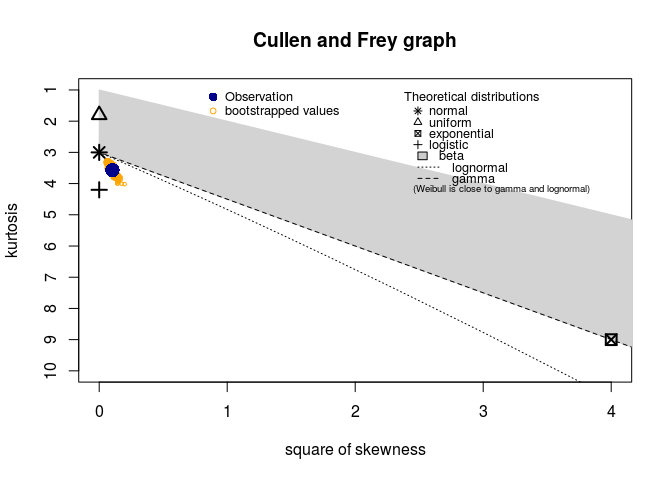
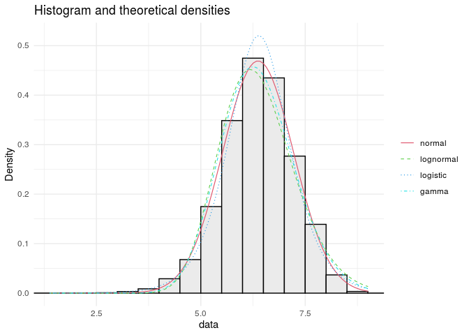
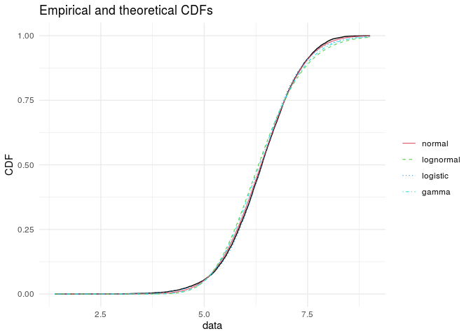
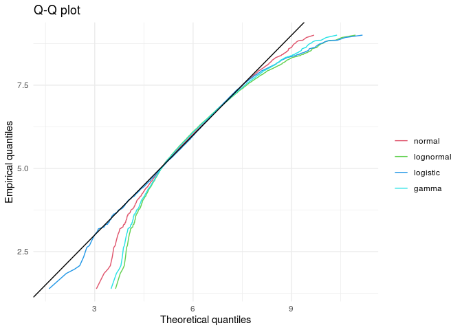
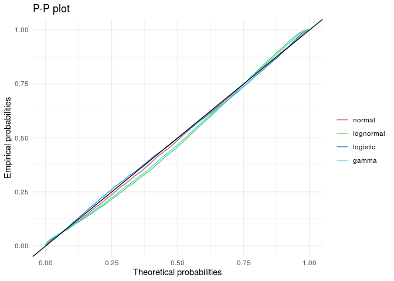
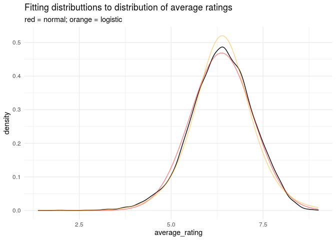

users\_rated
================
Arjun NR
11/21/2020

## Loading packages

``` r
library(tidyverse)
```

    ## ── Attaching packages ─────────────────────────────────────── tidyverse 1.3.0 ──

    ## ✓ ggplot2 3.3.2     ✓ purrr   0.3.4
    ## ✓ tibble  3.0.4     ✓ dplyr   1.0.2
    ## ✓ tidyr   1.1.2     ✓ stringr 1.4.0
    ## ✓ readr   1.3.1     ✓ forcats 0.5.0

    ## ── Conflicts ────────────────────────────────────────── tidyverse_conflicts() ──
    ## x dplyr::filter() masks stats::filter()
    ## x dplyr::lag()    masks stats::lag()

``` r
library(broom)
library(pander)
library(here)
```

    ## here() starts at /cloud/project

``` r
library(tidymodels)
```

    ## ── Attaching packages ────────────────────────────────────── tidymodels 0.1.1 ──

    ## ✓ dials     0.0.9      ✓ rsample   0.0.8 
    ## ✓ infer     0.5.3      ✓ tune      0.1.2 
    ## ✓ modeldata 0.1.0      ✓ workflows 0.2.1 
    ## ✓ parsnip   0.1.4      ✓ yardstick 0.0.7 
    ## ✓ recipes   0.1.15

    ## ── Conflicts ───────────────────────────────────────── tidymodels_conflicts() ──
    ## x scales::discard() masks purrr::discard()
    ## x dplyr::filter()   masks stats::filter()
    ## x recipes::fixed()  masks stringr::fixed()
    ## x dplyr::lag()      masks stats::lag()
    ## x yardstick::spec() masks readr::spec()
    ## x recipes::step()   masks stats::step()

``` r
library(fitdistrplus)
```

    ## Loading required package: MASS

    ## 
    ## Attaching package: 'MASS'

    ## The following object is masked from 'package:dplyr':
    ## 
    ##     select

    ## Loading required package: survival

## Relevant work from proposal

``` r
board_games <- read_csv(here("data/board_games.csv"))
```

``` r
board_games_splitcats %>%
  ggplot() +
  geom_point(aes(x = users_rated, y = average_rating), alpha = 0.5) +
  scale_x_log10() +
  labs(
  x = "Number of ratings",
  y = "Average ratings",
  title = "Number of ratings against average rating"
  )
```

<!-- -->

This plot suggests that games with more ratings tend to have an average
rating closer to just under 7.5. However, this may be because there are
more games with a rating of 7.5, which increases the likelihood that
there will be a game with particularly a large number of ratings. To
analyze this further, we will need to eliminate the effect of this
confounding variable (number of games with a given rating) to properly
analyze the relationship between the two variables.

## Further work

``` r
board_games_splitcats %>%
  ggplot() +
  geom_point(aes(x = users_rated, y = average_rating), alpha = 0.05) +
  geom_density(aes(x = users_rated, y = (..scaled.. * 5)), colour = "red") +
  geom_density(aes(x = (..scaled.. * 1e4), y = average_rating), colour = "orange") +
  scale_x_log10() +
  labs(
  x = "Number of ratings",
  y = "Average ratings",
  title = "Number of ratings against average rating", 
  subtitle = "Showing density plots of x and y overlayed"
  ) + 
  scale_colour_viridis_c()
```

<!-- -->

``` r
  # xlim(NA, 20000)
```

Below, I have attempted to create a 3D plot of average\_rating against
users\_rated against year\_published. It was not particularly
informative.

``` r
library(plotly)

board_games_splitcats %>% 
  plot_ly(x = ~users_rated, y = ~average_rating, z = ~year_published, type = "scatter3d", mode = "markers", marker = list(color = ~year_published, colorscale = c('#FFE1A1', '#683531'), showscale = TRUE), size = 1, opacity = 0.1)
# plot_ly(x=temp, y=pressure, z=dtime, type="scatter3d", mode="markers", color=temp)
```

### Modelling average\_rating from users\_rated

``` r
set.seed(314159)
bg_nrate_split <- initial_split(board_games_splitcats, prop = 0.8)
train_data <- training(bg_nrate_split)
test_data <- testing(bg_nrate_split)

bg_nrate_rec <- recipe(
  average_rating ~ users_rated,
  data = train_data
) %>% 
  step_log(users_rated)

bg_nrate_model <- linear_reg() %>% 
  set_engine("lm")

bg_nrate_wflow <- workflow() %>% 
  add_model(bg_nrate_model) %>% 
  add_recipe(bg_nrate_rec)

bg_nrate_fit <- bg_nrate_wflow %>%
  fit(data = train_data)

bg_nrate_fit_tidy <- tidy(bg_nrate_fit)
# bg_nrate_fit_aug <- augment(bg_nrate_fit) # Why does this break?

# Evaluation
set.seed(314159)
folds <- vfold_cv(train_data, v = 5)

bg_nrate_fit_vfold <- bg_nrate_wflow %>% 
  fit_resamples(folds)
```

    ## 
    ## Attaching package: 'rlang'

    ## The following objects are masked from 'package:purrr':
    ## 
    ##     %@%, as_function, flatten, flatten_chr, flatten_dbl, flatten_int,
    ##     flatten_lgl, flatten_raw, invoke, list_along, modify, prepend,
    ##     splice

    ## 
    ## Attaching package: 'vctrs'

    ## The following object is masked from 'package:dplyr':
    ## 
    ##     data_frame

    ## The following object is masked from 'package:tibble':
    ## 
    ##     data_frame

``` r
# Metrics for model fitted to v-fold train data: 
train_metrics <- collect_metrics(bg_nrate_fit_vfold)

# predictions and metrics for test data
bg_nrate_pred <- predict(bg_nrate_fit, test_data) %>% 
  bind_cols(
    predict(bg_nrate_fit, test_data, type = "pred_int"),
    test_data %>% dplyr::select(average_rating, users_rated, name)
  )

test_rmse <- rmse(bg_nrate_pred, truth = average_rating, estimate = .pred)
test_rsq <- rsq(bg_nrate_pred, truth = average_rating, estimate = .pred)

# tibble of metrics for both train and test data
train_test_metrics <- tribble(
  ~data, ~metric, ~value,
  "train", "rmse", train_metrics$mean[1],
  "train", "rsq", train_metrics$mean[2],
  "test", "rmse", test_rmse$.estimate[1],
  "test", "rsq", test_rsq$.estimate[1],
) %>% 
  pivot_wider(names_from = data, values_from = value)

# plot of model on full data
predict(bg_nrate_fit, board_games_splitcats) %>% 
  bind_cols(
    predict(bg_nrate_fit, board_games_splitcats, type = "pred_int"),
    board_games_splitcats %>% dplyr::select(average_rating, users_rated, name)
  ) %>% 
  ggplot(aes(x = users_rated)) + 
  geom_point(aes(y = average_rating), alpha = 0.2) + 
  geom_line(aes(y = .pred), colour = "red") + 
  geom_line(aes(y = .pred_upper), colour = "dark red", linetype = "dashed") +
  geom_line(aes(y = .pred_lower), colour = "dark red", linetype = "dashed") + 
  scale_x_log10()
```

<!-- -->

### Modelling with all

``` r
board_games_splitcats <- board_games %>% 
  mutate(categories = str_split(category, ","))

popular_categories <- board_games_splitcats %>%
  pull(categories) %>%
  unlist %>%
  as_tibble %>%
  count(value) %>%
  arrange(desc(n)) %>%
  head(6) %>%
  pull(value)


board_games_empty <- board_games_splitcats %>%
  filter(FALSE)
board_games_popcats <- board_games_empty

for (c in popular_categories) {
  board_games_popcats <- full_join(
    board_games_popcats,
    board_games_splitcats %>%
      filter(map_lgl(categories, ~c %in% .x)) %>%
      mutate(category = c)
  )
}
```

    ## Joining, by = c("game_id", "description", "image", "max_players", "max_playtime", "min_age", "min_players", "min_playtime", "name", "playing_time", "thumbnail", "year_published", "artist", "category", "compilation", "designer", "expansion", "family", "mechanic", "publisher", "average_rating", "users_rated", "categories")
    ## Joining, by = c("game_id", "description", "image", "max_players", "max_playtime", "min_age", "min_players", "min_playtime", "name", "playing_time", "thumbnail", "year_published", "artist", "category", "compilation", "designer", "expansion", "family", "mechanic", "publisher", "average_rating", "users_rated", "categories")
    ## Joining, by = c("game_id", "description", "image", "max_players", "max_playtime", "min_age", "min_players", "min_playtime", "name", "playing_time", "thumbnail", "year_published", "artist", "category", "compilation", "designer", "expansion", "family", "mechanic", "publisher", "average_rating", "users_rated", "categories")
    ## Joining, by = c("game_id", "description", "image", "max_players", "max_playtime", "min_age", "min_players", "min_playtime", "name", "playing_time", "thumbnail", "year_published", "artist", "category", "compilation", "designer", "expansion", "family", "mechanic", "publisher", "average_rating", "users_rated", "categories")
    ## Joining, by = c("game_id", "description", "image", "max_players", "max_playtime", "min_age", "min_players", "min_playtime", "name", "playing_time", "thumbnail", "year_published", "artist", "category", "compilation", "designer", "expansion", "family", "mechanic", "publisher", "average_rating", "users_rated", "categories")
    ## Joining, by = c("game_id", "description", "image", "max_players", "max_playtime", "min_age", "min_players", "min_playtime", "name", "playing_time", "thumbnail", "year_published", "artist", "category", "compilation", "designer", "expansion", "family", "mechanic", "publisher", "average_rating", "users_rated", "categories")

``` r
set.seed(314159)
bg_split <- initial_split(board_games_popcats, prop = 0.8)
train_data <- training(bg_split)
test_data <- testing(bg_split)


bg_rec <- recipe(
  average_rating ~ users_rated + category + year_published + playing_time,
  data = train_data
) %>% 
  step_log(users_rated)

bg_model <- linear_reg() %>% 
  set_engine("lm")

bg_wflow <- workflow() %>% 
  add_model(bg_model) %>% 
  add_recipe(bg_rec)

bg_fit <- bg_wflow %>%
  fit(data = train_data)

bg_fit_tidy <- tidy(bg_fit)

bg_fit_tidy
```

    ## # A tibble: 9 x 5
    ##   term                       estimate std.error statistic   p.value
    ##   <chr>                         <dbl>     <dbl>     <dbl>     <dbl>
    ## 1 (Intercept)             -50.8       1.49         -34.2  5.30e-237
    ## 2 users_rated               0.208     0.00621       33.5  5.62e-229
    ## 3 categoryEconomic          0.329     0.0304        10.8  5.06e- 27
    ## 4 categoryFantasy           0.230     0.0266         8.65 6.24e- 18
    ## 5 categoryFighting          0.327     0.0296        11.0  4.56e- 28
    ## 6 categoryScience Fiction   0.311     0.0305        10.2  3.70e- 24
    ## 7 categoryWargame           0.921     0.0240        38.3  3.08e-292
    ## 8 year_published            0.0279    0.000742      37.5  3.34e-281
    ## 9 playing_time              0.0000346 0.0000103      3.35 8.03e-  4

``` r
# Evaluation
set.seed(314159)
folds <- vfold_cv(train_data, v = 5)

bg_fit_vfold <- bg_wflow %>% 
  fit_resamples(folds)

# Metrics for model fitted to v-fold train data: 
bg_train_metrics <- collect_metrics(bg_fit_vfold)

# predictions and metrics for test data
bg_pred <- predict(bg_fit, test_data) %>% 
  bind_cols(
    predict(bg_fit, test_data, type = "pred_int"),
    test_data %>% dplyr::select(average_rating, users_rated, name)
  )

bg_test_rmse <- rmse(bg_nrate_pred, truth = average_rating, estimate = .pred)
bg_test_rsq <- rsq(bg_nrate_pred, truth = average_rating, estimate = .pred)

bg_train_adj_rsq <- glance(bg_fit %>% pull_workflow_fit)$adj.r.squared[1]

# tibble of metrics for both train and test data
bg_train_test_metrics <- tribble(
  ~data, ~metric, ~value,
  "train", "rmse", bg_train_metrics$mean[1],
  "train", "rsq", bg_train_metrics$mean[2],
  "test", "rmse", bg_test_rmse$.estimate[1],
  "test", "rsq", bg_test_rsq$.estimate[1],
  "train", "adj rsq", bg_train_adj_rsq
) %>% 
  pivot_wider(names_from = data, values_from = value)

bg_train_test_metrics
```

    ## # A tibble: 3 x 3
    ##   metric  train   test
    ##   <chr>   <dbl>  <dbl>
    ## 1 rmse    0.712  0.830
    ## 2 rsq     0.303  0.108
    ## 3 adj rsq 0.323 NA

### Fitting a statistical distribution to the distribution of average\_rating values

``` r
my_data <- board_games_splitcats$average_rating
descdist(my_data, discrete=FALSE, boot=500)
```

<!-- -->

    ## summary statistics
    ## ------
    ## min:  1.38421   max:  9.00392 
    ## median:  6.392965 
    ## mean:  6.370856 
    ## estimated sd:  0.850364 
    ## estimated skewness:  -0.3212839 
    ## estimated kurtosis:  3.567292

``` r
fit <- function(data, distr) {
  fit <- fitdist(data, distr)
  
  print(summary(fit))
  
  return(fit)
}

fit_n  <- fit(my_data, "norm")
```

    ## Fitting of the distribution ' norm ' by maximum likelihood 
    ## Parameters : 
    ##       estimate  Std. Error
    ## mean 6.3708560 0.008285693
    ## sd   0.8503236 0.005858833
    ## Loglikelihood:  -13236.62   AIC:  26477.24   BIC:  26491.77 
    ## Correlation matrix:
    ##      mean sd
    ## mean    1  0
    ## sd      0  1

``` r
fit_ln  <- fit(my_data, "lnorm")
```

    ## Fitting of the distribution ' lnorm ' by maximum likelihood 
    ## Parameters : 
    ##          estimate   Std. Error
    ## meanlog 1.8421926 0.0013768693
    ## sdlog   0.1413019 0.0009733742
    ## Loglikelihood:  -13736.62   AIC:  27477.25   BIC:  27491.77 
    ## Correlation matrix:
    ##         meanlog sdlog
    ## meanlog       1     0
    ## sdlog         0     1

``` r
fit_l  <- fit(my_data, "logis")
```

    ## Fitting of the distribution ' logis ' by maximum likelihood 
    ## Parameters : 
    ##           estimate  Std. Error
    ## location 6.3873429 0.008160366
    ## scale    0.4801679 0.003883678
    ## Loglikelihood:  -13244.85   AIC:  26493.7   BIC:  26508.23 
    ## Correlation matrix:
    ##              location        scale
    ## location  1.000000000 -0.008117982
    ## scale    -0.008117982  1.000000000

``` r
fit_g  <- fit(my_data, "gamma")
```

    ## Fitting of the distribution ' gamma ' by maximum likelihood 
    ## Parameters : 
    ##        estimate Std. Error
    ## shape 52.567628  0.7221126
    ## rate   8.251226  0.1138869
    ## Loglikelihood:  -13514.93   AIC:  27033.85   BIC:  27048.37 
    ## Correlation matrix:
    ##           shape      rate
    ## shape 1.0000000 0.9952481
    ## rate  0.9952481 1.0000000

``` r
# The following code is based on (Neto, 2015)
plot.legend <- c("normal", "lognormal", "logistic", "gamma")

denscomp(list(fit_n, fit_ln, fit_l, fit_g), legendtext = plot.legend, plotstyle = "ggplot") + theme_minimal()
```

<!-- -->

``` r
cdfcomp(list(fit_n, fit_ln, fit_l, fit_g), legendtext = plot.legend, plotstyle = "ggplot") + theme_minimal()
```

    ## Warning: Ignoring unknown parameters: shape

<!-- -->

``` r
qqcomp(list(fit_n, fit_ln, fit_l, fit_g), legendtext = plot.legend, plotstyle = "ggplot") + theme_minimal()
```

<!-- -->

``` r
ppcomp(list(fit_n, fit_ln, fit_l, fit_g), legendtext = plot.legend, plotstyle = "ggplot") + theme_minimal()
```

<!-- -->

``` r
gofstat(list(fit_n, fit_ln, fit_g, fit_l), fitnames = c("norm", "lnorm", "gamma", "logis"))
```

    ## Goodness-of-fit statistics
    ##                                    norm       lnorm       gamma     logis
    ## Kolmogorov-Smirnov statistic 0.01661679  0.04662134  0.03630484 0.0156024
    ## Cramer-von Mises statistic   0.78956749  8.11373133  4.69581775 0.6976891
    ## Anderson-Darling statistic   6.26348822 53.78161017 31.84053598 6.5997685
    ## 
    ## Goodness-of-fit criteria
    ##                                    norm    lnorm    gamma    logis
    ## Akaike's Information Criterion 26477.24 27477.25 27033.85 26493.70
    ## Bayesian Information Criterion 26491.77 27491.77 27048.37 26508.23

``` r
sech <- function(x) {
  1 / cosh(x)
}

logis <- function(x, u, s) {
  y <- (1 / (4 * s)) * (sech((x - u) / (2 * s)))^2
  return(y)
} # inspired by code from (Sauer, 2017)

logis_av_rating <- function(x) {
  logis(x, fit_l$estimate[1], fit_l$estimate[2])
}

board_games_splitcats %>% 
  ggplot(aes(x = average_rating)) + 
  geom_density() + 
  stat_function(
    fun = dnorm, 
    args = list(
      mean = fit_n$estimate[1], 
      sd = fit_n$estimate[2]
    ), 
    colour = "red", 
    alpha = 0.5
  ) + 
  stat_function(fun = logis_av_rating, colour = "orange", alpha = 0.5) + 
  theme_minimal() + 
  labs(
    title = "Fitting distributtions to distribution of average ratings", 
    subtitle = "red = normal; orange = logistic"
  )
```

<!-- -->

### Modelling distribution of average\_rating from users\_rated

What I am trying to do in next chunk is model the distribution of
average\_rating depending on users\_rated. Thus the steps will likely
involve:

1.  Bin users\_rated (unless I can do it in a moving average style)
2.  Fit normal (or logistic) distr. to average\_rating density of each
    bin (ie. find y-bar and s\_y^2)
3.  Model normal distr. as function of users\_rated (ie. modelling y-bar
    and s\_y^2 as functions of users\_rated)

Hopefully will then have a model which gives, for each users\_rated, a
probability distribution of average\_rating

``` r
# eval = FALSE as code not yet functioning


# Unfinished
## Is this the right way of going about it? need to look in to this more

#Feedback:
##in predict() can have confidence interval for each value vs the average - this will give some indication of distribution around the line. Not necessarily good idea to use sd to predict normal distribution as then you are imposing the distribution (guessing it) rather than obtaining it. 
#Can say in project that this is something we could do further (predicting distribution) if give reasons, even if don't necessarily do it. 
#estimating a prior; bayesian distributions
```
