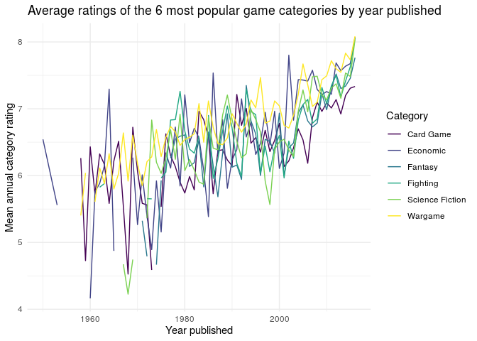
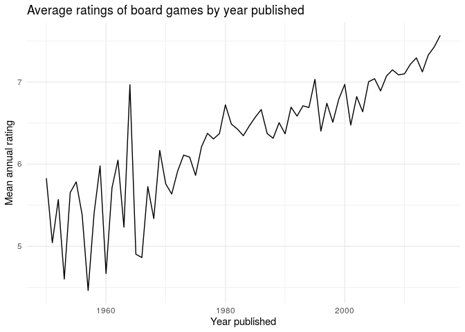
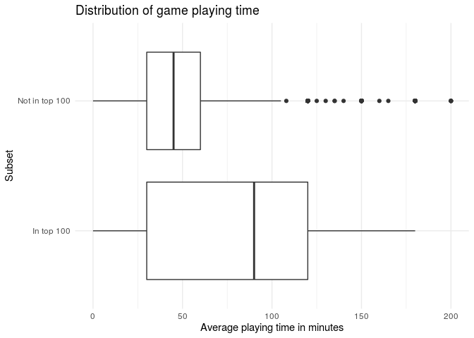
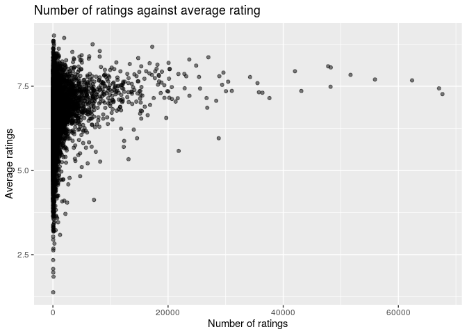

Project proposal
================
Too Legit to Overfit

``` r
library(tidyverse)
library(broom)
library(pander)
library(here)
```

``` r
board_games <- read_csv(here("data/board_games.csv"))
```

## 1\. Introduction

The dataset we are looking at is a collection of board games from Board
Game Geeks, which is a crowd-sourced board game review platform.

We would like to use this dataset to analyze the factors that will
affect the rating of a board game. We will be looking at
`year_published`, `category`, `playing_time`, and `users_rated` in
relation to `average_rating`.

## 2\. Data

``` r
glimpse(board_games)
```

    ## Rows: 10,532
    ## Columns: 22
    ## $ game_id        <dbl> 1, 2, 3, 4, 5, 6, 7, 8, 9, 10, 11, 12, 13, 14, 15, 16,…
    ## $ description    <chr> "Die Macher is a game about seven sequential political…
    ## $ image          <chr> "//cf.geekdo-images.com/images/pic159509.jpg", "//cf.g…
    ## $ max_players    <dbl> 5, 4, 4, 4, 6, 6, 2, 5, 4, 6, 7, 5, 4, 4, 6, 4, 2, 8, …
    ## $ max_playtime   <dbl> 240, 30, 60, 60, 90, 240, 20, 120, 90, 60, 45, 60, 120…
    ## $ min_age        <dbl> 14, 12, 10, 12, 12, 12, 8, 12, 13, 10, 13, 12, 10, 10,…
    ## $ min_players    <dbl> 3, 3, 2, 2, 3, 2, 2, 2, 2, 2, 2, 2, 3, 3, 2, 3, 2, 2, …
    ## $ min_playtime   <dbl> 240, 30, 30, 60, 90, 240, 20, 120, 90, 60, 45, 45, 60,…
    ## $ name           <chr> "Die Macher", "Dragonmaster", "Samurai", "Tal der Köni…
    ## $ playing_time   <dbl> 240, 30, 60, 60, 90, 240, 20, 120, 90, 60, 45, 60, 120…
    ## $ thumbnail      <chr> "//cf.geekdo-images.com/images/pic159509_t.jpg", "//cf…
    ## $ year_published <dbl> 1986, 1981, 1998, 1992, 1964, 1989, 1978, 1993, 1998, …
    ## $ artist         <chr> "Marcus Gschwendtner", "Bob Pepper", "Franz Vohwinkel"…
    ## $ category       <chr> "Economic,Negotiation,Political", "Card Game,Fantasy",…
    ## $ compilation    <chr> NA, NA, NA, NA, NA, NA, NA, NA, NA, NA, NA, NA, "CATAN…
    ## $ designer       <chr> "Karl-Heinz Schmiel", "G. W. \"Jerry\" D'Arcey", "Rein…
    ## $ expansion      <chr> NA, NA, NA, NA, NA, NA, NA, NA, NA, "Elfengold,Elfenla…
    ## $ family         <chr> "Country: Germany,Valley Games Classic Line", "Animals…
    ## $ mechanic       <chr> "Area Control / Area Influence,Auction/Bidding,Dice Ro…
    ## $ publisher      <chr> "Hans im Glück Verlags-GmbH,Moskito Spiele,Valley Game…
    ## $ average_rating <dbl> 7.66508, 6.60815, 7.44119, 6.60675, 7.35830, 6.52534, …
    ## $ users_rated    <dbl> 4498, 478, 12019, 314, 15195, 73, 2751, 186, 1263, 672…

## 3\. Data analysis plan

Our predictor variables will be `year_published`, `category`,
`playing_time`, and `users_rated`. Our response variable will be
`average_rating`.

We will try to look for correlations between category and popularity,
number of ratings, and playtime. The most common categories are:

``` r
board_games_splitcats <- board_games %>% 
  mutate(categories = str_split(category, ","))

# Creates a tibble of the top six game categories (ranked by average_rating)
popular_categories <- board_games_splitcats %>%
  pull(categories) %>%
  unlist %>%
  as_tibble %>%
  count(value) %>%
  arrange(desc(n)) %>%
  head(6)

popular_categories %>%
  pander
```

|      value      |  n   |
| :-------------: | :--: |
|    Card Game    | 2981 |
|     Wargame     | 2034 |
|     Fantasy     | 1218 |
|    Fighting     | 900  |
|    Economic     | 878  |
| Science Fiction | 850  |

``` r
popular_categories <- pull(popular_categories, value)
```

``` r
# board_games_topcats is a data frame filtered so that it contains only games board games that fall into at least one of the six most popular categories
board_games_topcats <- board_games_splitcats %>% 
  filter(map_lgl(categories, ~any(popular_categories %in% .x)))
```

We can investigate the changes in quality of different categories of
games. For example, investigating how the quality of board games in the
six most common categories changes over time. As a measure of quality,
we use the mean rating given to a game in that category (that is, the
sum of all ratings in a category (in a given year) divided by the total
number of such ratings).

``` r
# av_annual_rating() finds average rating (of a category (cat) if given) of board games in dataframe given (df) for each year in which a board game of that category was published. Output is a dataframe. df must have columns `year published`, `categories` (a `list` of categories), `average_rating` and `year_published`. 
av_annual_rating <- function(df, cat = NULL) {
  {if(!is.null(cat)) {
    df %>% filter(map_lgl(categories, ~cat %in% .x))
  } else {
    df
  }} %>% 
  group_by(year_published) %>% 
  summarise(av_annual_rating = sum(average_rating * users_rated) / sum(users_rated))
}

# Applies av_annual_rating() to each category in popular_categories. The product of this is a list of tibles, so we reduce() this down to a single tibble. 
cats <- map(popular_categories, ~av_annual_rating(df = board_games_topcats, cat = .))

cat_ratings <- reduce(cats, ~full_join(.x,.y, by = "year_published")) %>% 
  arrange(year_published)

if(any(is.na(popular_categories))) {
  popular_categories[[which(is.na(popular_categories))]] <- "not_categorised"
} 

names(cat_ratings) <- c("year_published", popular_categories)
```

``` r
# Plots average rating for each top category against year published
cat_ratings %>% 
  pivot_longer(cols = 2:ncol(cat_ratings), names_to = "category", values_to = "av_rating") %>% 
  ggplot(aes(x = year_published, y = av_rating, colour = category)) + 
  geom_line() + 
  labs(
    x = "Year published", 
    y = "Mean annual category rating", 
    colour = "Category", 
    title = "Average ratings of the 6 most popular game categories by year published"
  ) + 
  scale_color_viridis_d() +
  theme_minimal()
```

<!-- -->

This plot indicates a fairly strong association between mean ratings (of
games in the six most popular categories) and time. That is, more recent
games (regardless of category) are rated more highly on average than
older games. We can investigate further whether this is something
universal across all categories, and whether any other variables such as
changes in playtime or game mechanics, for example, could be an
influence.

``` r
# Plots overall average rating against year published
board_games_splitcats %>% 
  av_annual_rating() %>% 
  ggplot(aes(x = year_published, y = av_annual_rating)) +
  geom_line() +
  labs(
    x = "Year published",
    y = "Mean annual rating",
    title = "Average ratings of board games by year published"
  ) +
  scale_color_viridis_d() +
  theme_minimal()
```

<!-- -->

Indeed the overall trend for board game ratings has been an increase in
ratings for more recently published games.

``` r
# Plots distribution of average ratings for 100 most popular games compared to all other games
board_games_splitcats %>% 
  mutate(
    top_games = if_else(
      rank(desc(board_games_splitcats$average_rating))<=100, 
      "In top 100", 
      "Not in top 100"
    )
  ) %>% 
ggplot() + 
  geom_boxplot(mapping = aes(playing_time, top_games)) + 
  xlim(NA, 200) + 
  labs(
    x = "Average playing time in minutes",
    y = "Subset",
    title = "Distribution of game playing time"
  ) +
  theme_minimal()
```

<!-- -->

As seen in the boxplots, games that are more highly rated tend to have a
longer playing time.

Plotting the number of ratings against the average rating of each game:

``` r
# Plots average rating against number of ratings
board_games_splitcats %>%
 ggplot() +
 geom_point(aes(x = users_rated, y = average_rating), alpha = 0.5) + 
 labs(
 x = "Number of ratings",
 y = "Average ratings",
 title = "Number of ratings against average rating"
 )
```

<!-- -->

This plot suggests that games with more ratings tend to have an average
rating closer to just under 7.5. However, this may be because there are
more games with a rating of 7.5, which increases the likelihood that
there will be a game with particularly a large number of ratings. To
analyze this further, we will need to eliminate the effect of this
confounding variable (number of games with a given rating) to properly
analyze the relationship between the two variables.

Hypothesis:

Category has an effect on the average rating, the year published and the
playing time have a positive association with the average rating, and as
the number of individual ratings rises the average rating tends towards
7.5.

In order to reach our conclusions we will need to model each individual
variable against the average rating and use statistical tests such as
the chi-squared test to evaluate the fit of each model. We will also use
correlation coefficient tests to investigate the strength of linear
relationships. We will use modeling to eliminate the influence of the
distribution of the average ratings on our graph plotting the number of
ratings against the average ratings.
