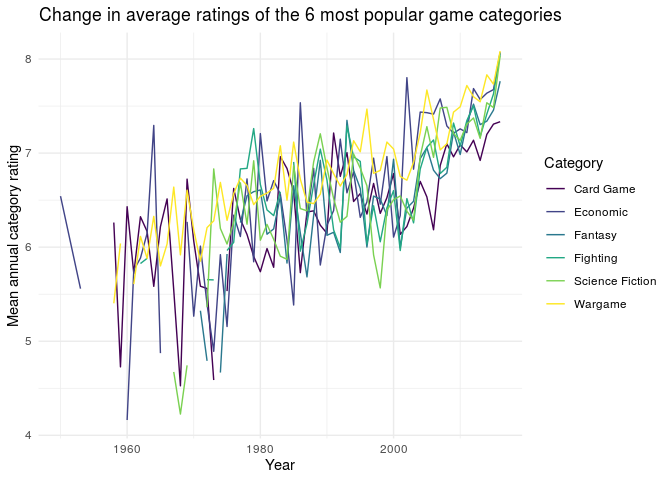

Project proposal
================
Too Legit to Overfit

``` r
library(tidyverse)
library(broom)
library(pander)
library(here)
```

``` r
board_games <- read_csv(here("data/board_games.csv"))
```

## 1\. Introduction

The dataset we are looking at is a collection of board games from Board
Game Geeks, which is a crowd-sourced board game review platform. The
variables in the dataset are:

We would like to use this dataset to analyse the differences between
different categories of board game, in terms of playtime, popularity,
and ratings.

## 2\. Data

``` r
glimpse(board_games)
```

    ## Rows: 10,532
    ## Columns: 22
    ## $ game_id        <dbl> 1, 2, 3, 4, 5, 6, 7, 8, 9, 10, 11, 12, 13, 14, 15, 16,…
    ## $ description    <chr> "Die Macher is a game about seven sequential political…
    ## $ image          <chr> "//cf.geekdo-images.com/images/pic159509.jpg", "//cf.g…
    ## $ max_players    <dbl> 5, 4, 4, 4, 6, 6, 2, 5, 4, 6, 7, 5, 4, 4, 6, 4, 2, 8, …
    ## $ max_playtime   <dbl> 240, 30, 60, 60, 90, 240, 20, 120, 90, 60, 45, 60, 120…
    ## $ min_age        <dbl> 14, 12, 10, 12, 12, 12, 8, 12, 13, 10, 13, 12, 10, 10,…
    ## $ min_players    <dbl> 3, 3, 2, 2, 3, 2, 2, 2, 2, 2, 2, 2, 3, 3, 2, 3, 2, 2, …
    ## $ min_playtime   <dbl> 240, 30, 30, 60, 90, 240, 20, 120, 90, 60, 45, 45, 60,…
    ## $ name           <chr> "Die Macher", "Dragonmaster", "Samurai", "Tal der Köni…
    ## $ playing_time   <dbl> 240, 30, 60, 60, 90, 240, 20, 120, 90, 60, 45, 60, 120…
    ## $ thumbnail      <chr> "//cf.geekdo-images.com/images/pic159509_t.jpg", "//cf…
    ## $ year_published <dbl> 1986, 1981, 1998, 1992, 1964, 1989, 1978, 1993, 1998, …
    ## $ artist         <chr> "Marcus Gschwendtner", "Bob Pepper", "Franz Vohwinkel"…
    ## $ category       <chr> "Economic,Negotiation,Political", "Card Game,Fantasy",…
    ## $ compilation    <chr> NA, NA, NA, NA, NA, NA, NA, NA, NA, NA, NA, NA, "CATAN…
    ## $ designer       <chr> "Karl-Heinz Schmiel", "G. W. \"Jerry\" D'Arcey", "Rein…
    ## $ expansion      <chr> NA, NA, NA, NA, NA, NA, NA, NA, NA, "Elfengold,Elfenla…
    ## $ family         <chr> "Country: Germany,Valley Games Classic Line", "Animals…
    ## $ mechanic       <chr> "Area Control / Area Influence,Auction/Bidding,Dice Ro…
    ## $ publisher      <chr> "Hans im Glück Verlags-GmbH,Moskito Spiele,Valley Game…
    ## $ average_rating <dbl> 7.66508, 6.60815, 7.44119, 6.60675, 7.35830, 6.52534, …
    ## $ users_rated    <dbl> 4498, 478, 12019, 314, 15195, 73, 2751, 186, 1263, 672…

## 3\. Data analysis plan

We will try to look for correlations between category and popularity,
number of ratings, and playtime. The most common categories are

``` r
board_games_splitcats <- board_games %>% 
  mutate(categories = str_split(category, ","))

popular_categories <- board_games_splitcats %>%
  pull(categories) %>%
  unlist %>%
  as_tibble %>%
  count(value) %>%
  arrange(desc(n)) %>%
  head(6)

popular_categories %>%
  pander
```

|      value      |  n   |
| :-------------: | :--: |
|    Card Game    | 2981 |
|     Wargame     | 2034 |
|     Fantasy     | 1218 |
|    Fighting     | 900  |
|    Economic     | 878  |
| Science Fiction | 850  |

``` r
popular_categories <- pull(popular_categories, value)
```

``` r
list_intersect <- function(a, b) {
  do_intersect = FALSE
  for (value in a) {
    if (value %in% b) {
      do_intersect = TRUE
    }
  }
  do_intersect
}

rows = c()
for (row in 1:nrow(board_games_splitcats)) {
  game_categories <- unlist(board_games_splitcats$categories[row])
  if (list_intersect(game_categories, popular_categories)) {
    rows <- append(rows, board_games_splitcats$game_id[row])
  }
}

board_games_topcats <- board_games_splitcats %>% 
  filter(game_id %in% rows) 
```

``` r
board_games_topcats <- board_games_splitcats %>% 
  filter(map_lgl(categories, ~any(popular_categories %in% .x)))

# Note this df has same name as above df because is exactly same df. Should choose preferred method and get rid of other.
```

We can investigate the changes in quality of different categories of
games. For example, investigating how the quality of board games in the
six most common categories changes over time. As a measure of quality,
we use the mean rating given to a game in that category (that is, the
sum of all ratings in a category (in a given year) divided by the total
number of such ratings).

``` r
av_annual_rating <- function(cat) {
  board_games_topcats %>%
  filter(map_lgl(categories, ~cat %in% .x)) %>% 
  group_by(year_published) %>% 
  summarise(av_annual_rating = sum(average_rating * users_rated) / sum(users_rated))
}

cats <- map(popular_categories, av_annual_rating)

cat_ratings <- reduce(cats, ~full_join(.x,.y, by = "year_published")) %>% 
  arrange(year_published)

names(cat_ratings) <- c("year_published", popular_categories)

cat_ratings %>% 
  pivot_longer(cols = 2:ncol(cat_ratings), names_to = "category", values_to = "av_rating") %>% 
  ggplot(aes(x = year_published, y = av_rating, colour = category)) + 
  geom_line() + 
  labs(
    x = "Year", 
    y = "Mean annual category rating", 
    colour = "Category", 
    title = "Change in average ratings of the 6 most popular game categories"
  ) + 
  scale_color_brewer(palette = "BrBG") + 
  theme_minimal()
```

<!-- -->

This plot indicates a fairly strong association between mean ratings (of
games in the six most popular categories) and time. That is, more recent
games (regardless of category) are rated more highly on average than
older games. We can investigate further whether this is something
universal across all categories, and whether any other variables such as
changes in playtime or game mechanics, for example, could be an
influence. This will require producing similar plots to investigate
relationships of variables over time, as well as calculating statistics
such as correlation coefficients to investigate relationships between
variables.
